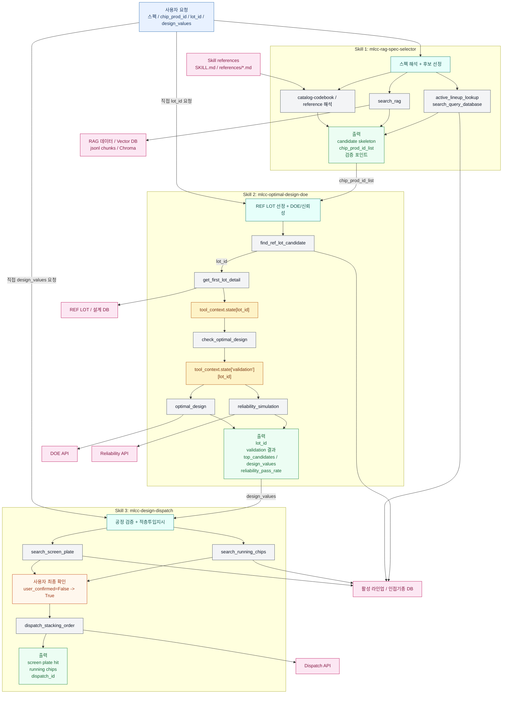

# 시스템 흐름 다이어그램

## 1. 상위 파이프라인 개요

```mermaid
flowchart LR
    classDef input fill:#E8F1FF,stroke:#2B6CB0,color:#1A365D
    classDef agent fill:#FFF4D6,stroke:#B7791F,color:#744210
    classDef skill fill:#E6FFFA,stroke:#0F766E,color:#134E4A
    classDef output fill:#ECFDF3,stroke:#15803D,color:#166534

    U["사용자 요청<br/>스펙 요청 / lot_id 요청 / design_values 요청"]:::input
    A["Root Agent<br/>의도 분석 + Skill 선택"]:::agent

    S1["Skill 1<br/>mlcc-rag-spec-selector"]:::skill
    O1["출력<br/>candidate skeleton<br/>chip_prod_id_list"]:::output

    S2["Skill 2<br/>mlcc-optimal-design-doe"]:::skill
    O2["출력<br/>lot_id / validation<br/>top_candidates / design_values"]:::output

    S3["Skill 3<br/>mlcc-design-dispatch"]:::skill
    O3["출력<br/>screen plate hit<br/>running chips / dispatch_id"]:::output

    U --> A
    A -->|"스펙 선정"| S1
    A -->|"lot_id 기반 DOE / 신뢰성"| S2
    A -->|"design_values 기반 검증 / 투입"| S3

    S1 --> O1
    O1 -->|"후속 설계 요청"| S2
    S2 --> O2
    O2 -->|"공정 검증 / 투입 요청"| S3
    S3 --> O3
```

## 2. 상세 I/O 및 외부 의존성

```mermaid
flowchart TD
    classDef input fill:#E8F1FF,stroke:#2B6CB0,color:#1A365D
    classDef skill fill:#E6FFFA,stroke:#0F766E,color:#134E4A
    classDef tool fill:#F3F4F6,stroke:#4B5563,color:#111827
    classDef state fill:#FEF3C7,stroke:#B45309,color:#78350F
    classDef external fill:#FCE7F3,stroke:#BE185D,color:#831843
    classDef output fill:#ECFDF3,stroke:#15803D,color:#166534
    classDef confirm fill:#FFF7ED,stroke:#C2410C,color:#9A3412

    U["사용자 요청<br/>스펙 / chip_prod_id / lot_id / design_values"]:::input

    subgraph G1["Skill 1: mlcc-rag-spec-selector"]
        S1["스펙 해석 + 후보 선정"]:::skill
        S1T1["catalog-codebook / reference 해석"]:::tool
        S1T2["search_rag"]:::tool
        S1T3["active_lineup_lookup<br/>search_query_database"]:::tool
        O1["출력<br/>candidate skeleton<br/>chip_prod_id_list<br/>검증 포인트"]:::output
    end

    subgraph G2["Skill 2: mlcc-optimal-design-doe"]
        S2["REF LOT 선정 + DOE/신뢰성"]:::skill
        S2T1["find_ref_lot_candidate"]:::tool
        S2T2["get_first_lot_detail"]:::tool
        ST1["tool_context.state[lot_id]"]:::state
        S2T3["check_optimal_design"]:::tool
        ST2["tool_context.state['validation'][lot_id]"]:::state
        S2T4["optimal_design"]:::tool
        S2T5["reliability_simulation"]:::tool
        O2["출력<br/>lot_id<br/>validation 결과<br/>top_candidates / design_values<br/>reliability_pass_rate"]:::output
    end

    subgraph G3["Skill 3: mlcc-design-dispatch"]
        S3["공정 검증 + 적층투입지시"]:::skill
        S3T1["search_screen_plate"]:::tool
        S3T2["search_running_chips"]:::tool
        C1["사용자 최종 확인<br/>user_confirmed=False -> True"]:::confirm
        S3T3["dispatch_stacking_order"]:::tool
        O3["출력<br/>screen plate hit<br/>running chips<br/>dispatch_id"]:::output
    end

    D1["Skill references<br/>SKILL.md / references/*.md"]:::external
    X1["RAG 데이터 / Vector DB<br/>jsonl chunks / Chroma"]:::external
    X2["활성 라인업 / 인접기종 DB"]:::external
    X3["REF LOT / 설계 DB"]:::external
    X4["DOE API"]:::external
    X5["Reliability API"]:::external
    X6["Dispatch API"]:::external

    U --> S1
    U -->|"직접 lot_id 요청"| S2
    U -->|"직접 design_values 요청"| S3

    D1 --> S1T1
    S1 --> S1T1
    S1 --> S1T2
    S1 --> S1T3
    S1T2 --> X1
    S1T3 --> X2
    S1T1 --> O1
    S1T2 --> O1
    S1T3 --> O1
    O1 -->|"chip_prod_id_list"| S2

    S2 --> S2T1
    S2T1 --> X2
    S2T1 -->|"lot_id"| S2T2
    S2T2 --> X3
    S2T2 --> ST1
    ST1 --> S2T3
    S2T3 --> ST2
    ST2 --> S2T4
    ST2 --> S2T5
    S2T4 --> X4
    S2T5 --> X5
    S2T4 --> O2
    S2T5 --> O2
    O2 -->|"design_values"| S3

    S3 --> S3T1
    S3 --> S3T2
    S3T1 --> X2
    S3T2 --> X2
    S3T1 --> C1
    S3T2 --> C1
    C1 --> S3T3
    S3T3 --> X6
    S3T3 --> O3
```
