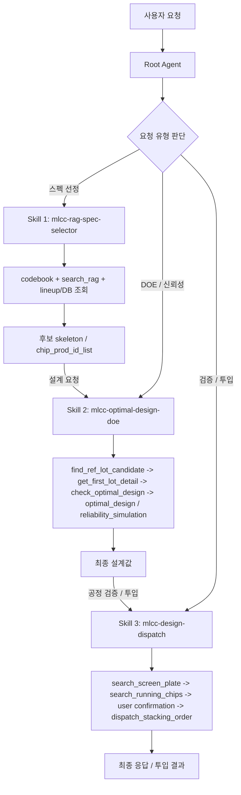

```mermaid
flowchart TD
    U["사용자 요청"] --> A["Root Agent"]
    A --> R{"요청 유형 판단"}

    R -->|"스펙 선정"| S1["Skill 1: mlcc-rag-spec-selector"]
    S1 --> T1["codebook + search_rag + lineup/DB 조회"]
    T1 --> O1["후보 skeleton / chip_prod_id_list"]

    O1 -->|"설계 요청"| S2["Skill 2: mlcc-optimal-design-doe"]
    R -->|"DOE / 신뢰성"| S2
    S2 --> T2["find_ref_lot_candidate -> get_first_lot_detail -> check_optimal_design -> optimal_design / reliability_simulation"]
    T2 --> O2["최종 설계값"]

    O2 -->|"공정 검증 / 투입"| S3["Skill 3: mlcc-design-dispatch"]
    R -->|"검증 / 투입"| S3
    S3 --> T3["search_screen_plate -> search_running_chips -> user confirmation -> dispatch_stacking_order"]
    T3 --> F["최종 응답 / 투입 결과"]
```
